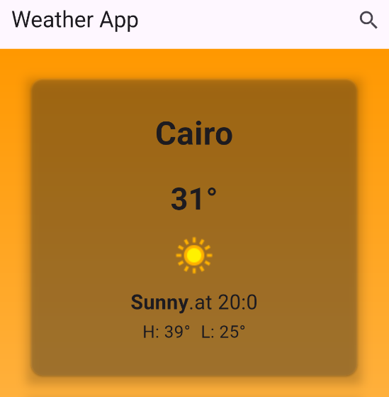
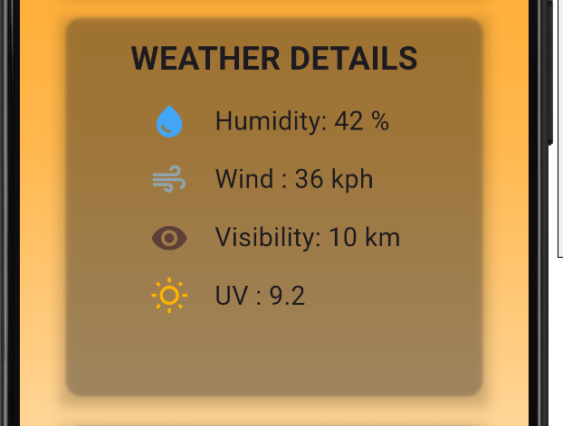
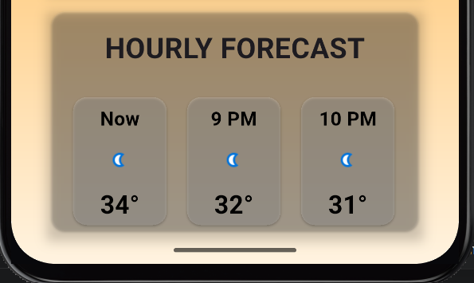

# Weather App

A Flutter weather application that provides real-time weather information using WeatherAPI.

## Features

- Search for weather by city name
- Display current weather information
- Display minimum and maximum temperatures
- Hourly weather forecast
- Weather details including:
  - Humidity
  - Wind speed
  - Visibility
  - UV index
- Animated weather-based background
- Error handling for invalid cities and API errors

## Technologies Used

- Flutter
- Dart
- Cubit (State Management)
- REST API
- WeatherAPI
- Dio
- JSON
- flutter_dotenv
- Git & GitHub

## How to Run

1. Clone the repository.
2. Run `flutter pub get`.
3. Create a `.env` file and add your WeatherAPI key.
4. Run the application using `flutter run`.

## Screenshots

### Current Weather

### Weather Details

### Hourly Forecast

